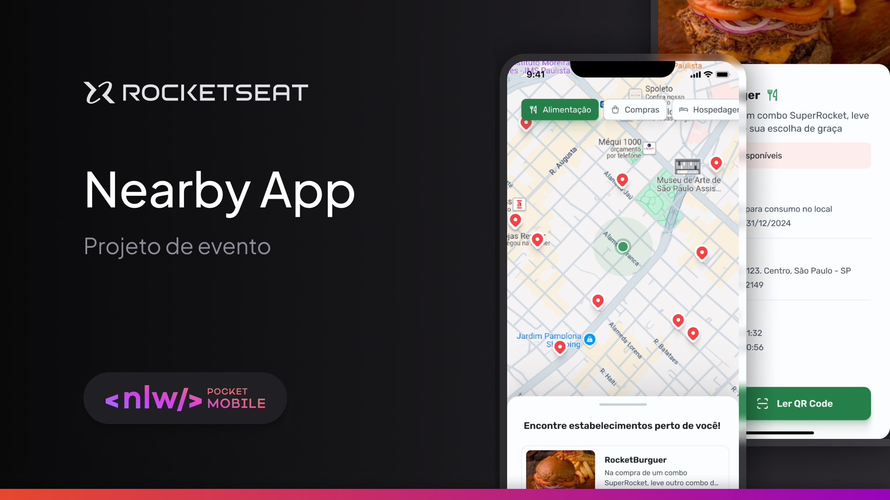

# Nearby




> O Nearby é um aplicativo desenvolvido durante o evento **NLW Pocket Mobile**, promovido pela **Rocketseat**. Ele permite visualizar estabelecimentos em uma localização padrão, simulando uma ferramenta para explorar locais ao redor.

### Ajustes e melhorias

O projeto ainda está em desenvolvimento e as próximas atualizações incluirão:

- [x] Implementação de layout responsivo.
- [x] Configuração inicial de navegação entre telas.
- [ ] Integração com serviços de localização em tempo real.
- [ ] Adição de filtros para tipos de estabelecimentos.
- [ ] Melhorias na performance do aplicativo.

## 💻 Pré-requisitos

Antes de começar, verifique se você atende aos seguintes requisitos:

- **Node.js** e **npm** ou **yarn** instalados na máquina.
- Sistema operacional compatível: **Windows**, **Linux** ou **macOS**.
- Instale o **Expo CLI** para rodar o projeto.

## 🚀 Instalando Nearby

Para instalar o **Nearby**, siga estas etapas:

Linux e macOS:

```bash
git clone https://github.com/devsantx/nlw-pocket-nearby.git

cd nlw-pocket-nearby

npm install
```

Windows:

```bash
git clone https://github.com/devsantx/nlw-pocket-nearby.git

cd nlw-pocket-nearby

npm install
```

## ☕ Usando Nearby

1.Para usar o Nearby, siga estas etapas:

```bash
npx expo start
```

2. Abra o aplicativo no emulador ou dispositivo físico escaneando o QR Code gerado pelo Expo.

## 📫 Contribuindo para Nearby

Para contribuir com o Nearby, siga estas etapas:

1. Bifurque este repositório.
2. Crie um branch: git checkout -b <nome_branch>.
3. Faça suas alterações e confirme-as: git commit -m '<mensagem_commit>'
4. Envie para o branch original: git push origin <nome_do_projeto> / <local>
5. Crie a solicitação de pull.

Como alternativa, consulte a documentação do GitHub em [como criar uma solicitação pull](https://help.github.com/en/github/collaborating-with-issues-and-pull-requests/creating-a-pull-request).

## 🤝 Colaboradores

Agradecemos às seguintes pessoas que contribuíram para este projeto:

<table> <tr> <td align="center"> <a href="https://github.com/devsantx"> <br> <sub> <b>Kauan Santana</b> </sub> </a> </td> <td align="center"> <a href="https://www.rocketseat.com.br/"> <br> <sub> <b>Rocketseat</b> </sub> </a> </td> </tr> </table>

## 🤝 Agradecimentos

Agradeço à Rocketseat pela oportunidade de participar do NLW Pocket Mobile e aprender mais sobre desenvolvimento mobile com React Native. Este projeto é uma demonstração prática dos conhecimentos adquiridos durante o evento.

## 📬 Contato

- Portfólio: Meu Portfólio Online
- E-mail: kauansantana2721@gmail.com
- LinkedIn: linkedin.com/in/devsantx
